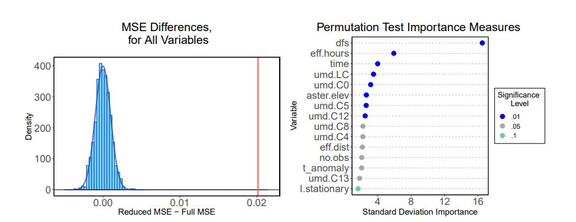

# RFtest
F-tests for random forests that are scalable and efficient. This package provides code for running the test for an _a priori_ specified subset of variables (`MSE_Test`), a marginal importance hypothesis test (`permtestImp` for default, `f_holdoutRF` for a faster holdout version), and several plotting/summarizing methods. Examples of output can be seen below:

See the original manuscript for details of/theory behind the method, https://arxiv.org/pdf/1904.07830.pdf. 
